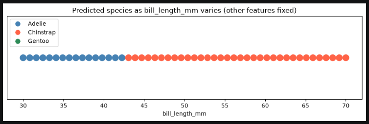
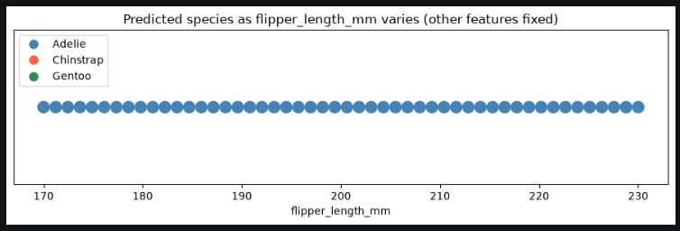
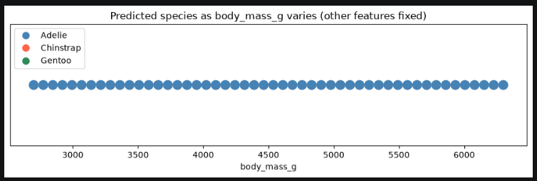
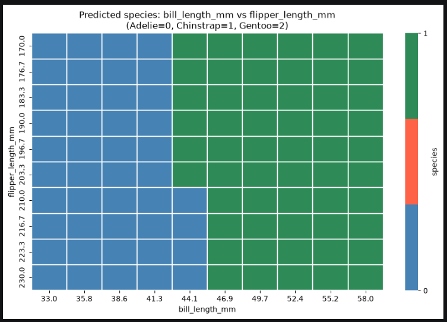
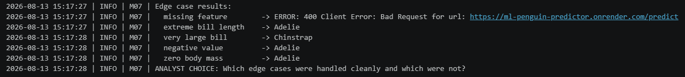

# ml-07-applied

> Professional Python project: investigating a deployed machine learning model.

## Project Description

This project focuses on learning to interrogate a deployed ML model
by probing it systematically with different inputs.

We learn to:

- call a live prediction API from a notebook
- vary input features and observe how predictions change
- identify decision boundaries and edge cases
- interpret model behavior from the outside

## Example Notebook + Your Notebook

Keep the example notebook as it is.
Either copy it or use it to build a new notebook that ends in _yourname.
See [docs/your-files.md] for more.

Links:

- [ml_07_case.ipynb](notebooks/ml_07_case.ipynb)

# Original ReadMe File

The original readme files was kept so that someone could follow the steps and implement the example and set up the project correctly.
However, that is not needed for documenting this project, so a link to the original is included here.

Link:

- [Original README File](ORIGINAL_README.md)

## Findings and Visuals

### Phase 4
In phase 4 we implemented a technical change to the example.
I chose to do a sweep for the features flipper_length_mm and body_mass_g as well as the original sweep for bill_length_mm.

There was a boundary shift for the original bill_length_mm but no boundary shift for either flipper_length_mm or body_mass_g.
From this we can assume that the bill_length_mm feature had the most influence on the prediction.

I kept the original Prediction Grid and Edge Cases.

For the prediction grid, there was a boundary switch between Adelie and Gentoo penguins when considering flipper length and bill length.
This makes sense as Gentoo penguins are larger than both Adelie and Chinstrap penguins.

For the edge cases, the only one handled well was the missing information. For extreme bill length, very large bill, negative value, and zero body mass there should have been an error message but instead it gave a prediction.

I would add limits to values on the API contracts. This way more error messages would pop up for information that doesn't fit the dataset.

### Phase 4 Documentation

[Phase 4 Notebook - ml_07_hummel.ipynb](notebooks/ml_07_hummel.ipynb)

### Phase 5

### Phase 5 Documentation

[Phase 4 Notebook - ml_07_hummel.ipynb](notebooks/ml_07_hummel.ipynb)

## Project Documentation

Additional project instructions, terms, and notes:

[docs/index.md](docs/index.md)

## Citation

[CITATION.cff](./CITATION.cff)

## License

[MIT](./LICENSE)
